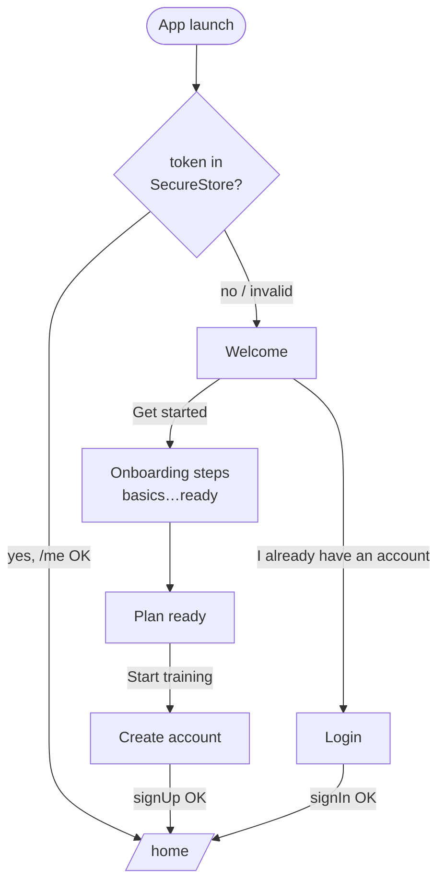

# Auth flow (F9)

Signup lands at the end of onboarding; login is a separate entry from Welcome.
Session token lives in `expo-secure-store`, restored on launch by
`useAuth.hydrate()`.

## Screens & session



## Signup / login request

```mermaid
sequenceDiagram
  participant App as Mobile (useAuth)
  participant W as auth-worker
  participant D1 as D1

  App->>W: POST /signup or /login {email, password}
  W->>D1: find / insert user (PBKDF2 verify or hash)
  W->>D1: insert sessions row (token, expires_at)
  W-->>App: { token, user }
  App->>App: SecureStore.setItem(token); status = signedIn

  Note over App,W: later, on launch
  App->>W: GET /me (Bearer token)
  W->>D1: token → session → user (check expiry)
  W-->>App: { user } or 401
```
