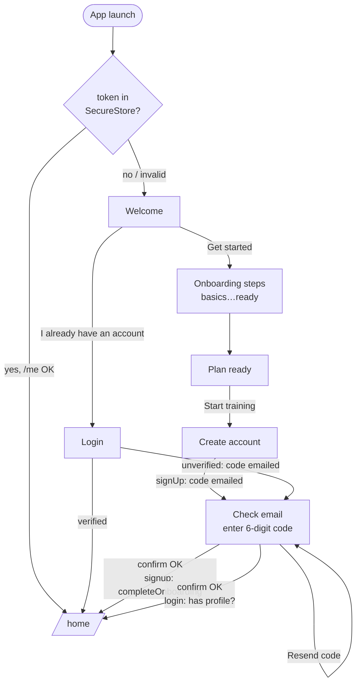

# Auth flow (F9)

Signup lands at the end of onboarding; login is a separate entry from Welcome.
Email verification is a **hard gate** (2026-07-06): signup/login issue **no
session** until a 6-digit code emailed via Resend is confirmed. Session token
lives in `expo-secure-store`, restored on launch by `useAuth.hydrate()`.

## Screens & session

```mermaid
flowchart TD
  Launch([App launch]) --> Hydrate{token in<br/>SecureStore?}
  Hydrate -- yes, /me OK --> Home[/home/]
  Hydrate -- no / invalid --> Welcome[Welcome]

  Welcome -- Get started --> Onb[Onboarding steps<br/>basics…ready]
  Welcome -- I already have an account --> Login[Login]

  Onb --> Ready[Plan ready]
  Ready -- Start training --> Account[Create account]

  Account -- signUp: code emailed --> Verify[Check email<br/>enter 6-digit code]
  Login -- verified --> Home
  Login -- unverified: code emailed --> Verify

  Verify -- confirm OK<br/>signup: completeOnboarding --> Home
  Verify -- confirm OK<br/>login: has profile? --> Home
  Verify -- Resend code --> Verify
```

## Signup / verify / login request

```mermaid
sequenceDiagram
  participant App as Mobile (useAuth)
  participant W as auth-worker
  participant DB as Turso
  participant R as Resend

  App->>W: POST /signup {email, password}
  W->>DB: insert user (email_verified=false, PBKDF2 hash)
  W->>DB: upsert email_codes (hashed 6-digit code, 10-min TTL)
  W->>R: send verification email (RESEND_FROM → to)
  W-->>App: 201 { verificationRequired, email }  (no token)

  App->>W: POST /verify/confirm {email, code}
  W->>DB: check code (TTL, ≤5 attempts) → set email_verified=true
  W->>DB: insert sessions row (token, expires_at)
  W-->>App: { token, user }
  App->>App: SecureStore.setItem(token); status = signedIn

  Note over App,W: unverified login is blocked
  App->>W: POST /login {email, password}
  W->>DB: verify password; email_verified?
  W->>R: (if unverified) re-send code
  W-->>App: 403 { verificationRequired, email } — else { token, user }
```

Policy: code is 6 digits, 10-minute TTL, ≤5 attempts, 60-second resend
cooldown; codes are stored **hashed** (PBKDF2), one active code per user.
