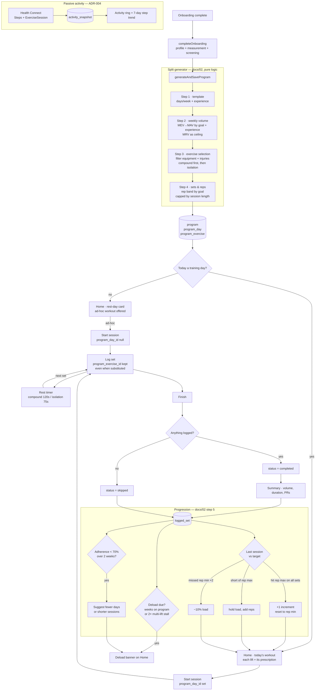

# Training loop — generate → train → progress

Covers features F3 (program generator), F4 (home + activity) and F5 (workout
logging). Spec: [02-split-generator-logic.md](../02-split-generator-logic.md),
[04-home-logging-ux.md](../04-home-logging-ux.md).

The closed loop is the point: what you log this session sets the targets for
the next one, and the aggregate of what you log adjusts the program itself.

## Notes

- **Planned and actual never merge.** `program_exercise` is the plan,
  `logged_set` is the actual; `program_exercise_id` links them and survives an
  exercise substitution, which is what makes plan-vs-actual, adherence, and
  substitution frequency computable later.
- **A session with no sets is `skipped`, not `completed`** — otherwise opening
  and abandoning the logger would inflate both streak and adherence.
- **Everything in the generator and progression boxes is pure** and unit
  tested (`splitGenerator.test.ts`, `progression.test.ts`); only the shaded
  DB nodes touch SQLite.
- **A failed Health Connect read keeps the previous snapshot** rather than
  writing zeroes, so a revoked permission does not erase a good day.
